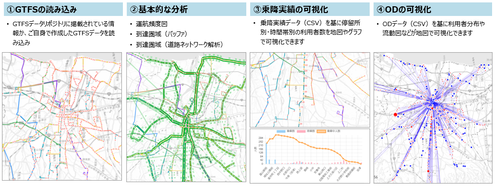

# 公共交通計画策定支援ツール

## 0. 目次

- [公共交通計画策定支援ツール](#公共交通計画策定支援ツール)
  - [0. 目次](#0-目次)
  - [1. 概要](#1-概要)
  - [2. 利用手順](#2-利用手順)
  - [3. 主な機能](#3-主な機能)
  - [4. 動作環境](#4-動作環境)
    - [推奨環境](#推奨環境)
    - [必要なソフトウェア](#必要なソフトウェア)
  - [5. インストールとセットアップ](#5-インストールとセットアップ)
  - [6. データ準備](#6-データ準備)
    - [サンプルデータについて](#サンプルデータについて)
    - [利用データについて](#利用データについて)
  - [7. ディレクトリ構成](#7-ディレクトリ構成)
  - [8. ライセンス](#8-ライセンス)
  - [9. 注意事項](#9-注意事項)
  - [10. お問い合わせ](#10-お問い合わせ)


## 1. 概要

国土交通省が推進する[Project LINKS](https://www.mlit.go.jp/links/)の一環として開発された「公共交通計画策定支援ツール」のソースコードを公開しています。
本システムは、GTFSデータをはじめとした公共交通分野のオープンデータ等を活用し、地域交通の現状の可視化や需給バランスの評価を行うことで、地域公共交通計画をはじめとする交通計画の検討を支援するシステムです。  
本システムの活用を促進することで、データに基づく路線再編や新たな交通サービスの導入等を可能とし、地域公共交通計画のアップデートを推進します。

本ツールでは以下の機能を提供します。
* GTFSデータの読み込み・可視化
* 運航頻度図、到達圏域分析
* 乗降実績の可視化
* ODデータの可視化



## 2. 利用手順

本システムの利用手順は、[操作マニュアル](./docs/manual.pdf)をご参照ください。

## 3. 主な機能

- **GTFSデータの読み込みと可視化**
  - GTFSデータリポジトリに掲載されている情報あるいはご自身で作成したGTFSデータを読み込み
  - 地図上で選択した停留所の時刻表の表示
  - 地図上で選択した路線が停車する停留所一覧の表示

- **運行頻度図の可視化**
  - 地図表示による運行頻度の可視化
  - サービス区分/時間帯別の運行本数の表示

- **到達圏域分析**
  - 任意地点を基準とした地図表示による到達圏域の可視化（バッファ分析及び道路ネットワークを使用した分析）

 - **乗降実績の可視化**
   - CSV形式の乗降実績データを読み込み
   - 地図・グラフによる停留所・路線・区間ごとの乗車中人数・乗車人数・降車人数の可視化
   - 乗車中人数・乗車人数・降車人数の平均・合計・最大値の集計

 - **ODデータの可視化**
   - CSV形式のODデータを読み込み
   - 地図表示によるOD分布の可視化
   - 停留所別乗車人数・降車人数・利用者数の可視化

## 4. 動作環境

### 推奨環境
- OS: Windows 10 / 11（WSL2環境）
- ブラウザ: Google Chrome / Microsoft Edge
- メモリ: 8GB以上推奨
- ストレージ: 1GB以上の空き容量

### 必要なソフトウェア
- Docker 24.0以上
- Docker Compose 2.20以上
- WSL2（Windows Subsystem for Linux 2）
- Ubuntu 22.04（WSL2上）

## 5. インストールとセットアップ

インストール方法は[こちら](./docs/howtobuild.md)を参照してください。


## 6. データ準備

本システムを活用するには、以下の主なデータが必要です。

- GTFSデータ
   - GTFSデータリポジトリに掲載されているGTFSデータを使用する場合は準備不要。
   - ご自身で作成したGTFSデータを作成する場合に必要です。

- 乗降実績データ
   - どのバス「いつ」「どこで」「何人が」乗り降りしたかを示すデータ。
   - ICカードデータや乗務員がカウントすることにより作成可能。
   - サンプルデータは[こちら](./example/data/dammy_jyoukou.csv)。　※実際の乗降実績と異なるダミーデータです。
  
- ODデータ
   - 停留所Aから停留所Bに、何人移動するかを示すデータ。
   - ICカードの履歴データ等をもとに作成可能。
   - サンプルデータは[こちら](./example/data/dammy_od.csv)。※実際のODと異なるダミーデータです。

### サンプルデータについて
本アプリケーションの操作を体験できるサンプルデータを公開しています。
サンプルデータをインプットデータとして、乗降実績の可視化及びOD分析の可視化の動作を確認できます。
なお、このサンプルデータはダミーデータとなり、実際の乗降実績とは一切関係ありません。

### 利用データについて
本プロジェクトで使用している地理空間データの一部は、[OpenStreetMap](https://www.openstreetmap.org) およびその貢献者により提供されています。 
データは [Open Database License (ODbL)](https://opendatacommons.org/licenses/odbl/) に基づいて使用されています。


## 7. ディレクトリ構成

```
gtfs-analysis-tool/
├── docs/
│ ├── 公共交通計画分析支援ツールマニュアル.pdf
│ └── (その他のドキュメント)
├── examples/
│ └── data/
│   └── (サンプルデータ、テンプレートデータ)
├── src/
│ └── (本システムのソースコード)
├── LICENSE.md
└── README.md
```

## 8. ライセンス

ソースコード及び関連ドキュメントの著作権は国土交通省に帰属します。
本ドキュメントはProject LINKSサイトポリシー（CCBY4.0及び公共データ利用規約第1.0版（PDL1.0））に従い提供されています。

## 9. 注意事項

- 動作保証  
  デプロイしたシステムは Windows 10 / 11 環境で、ブラウザ（Chrome, Edge）での動作を想定しています。
  検証フィールド（富山県富山市）での動作を確認しているものです。 
- 免責事項  
  本システムの利用や利用不能から生じるいかなる損害に対しても、開発者および国土交通省は一切の責任を負いません。

## 10. お問い合わせ

バグ報告や質問、機能要望などがございましたら、Issues へ起票いただくか、以下の連絡先までご連絡ください。

- パシフィックコンサルタンツ株式会社　(<pckk_links_gtfs@tk.pacific.co.jp>)

